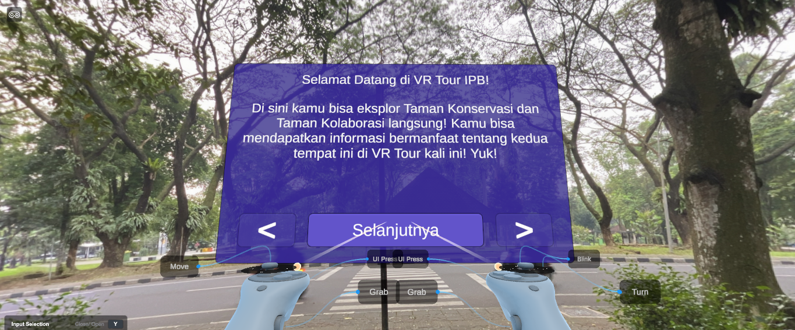
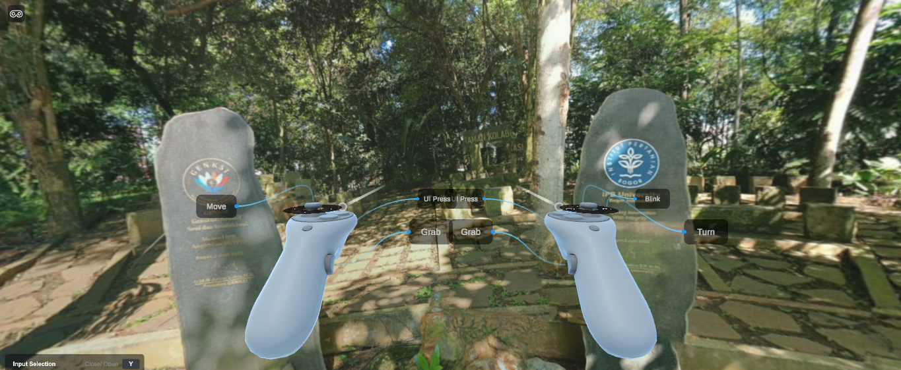
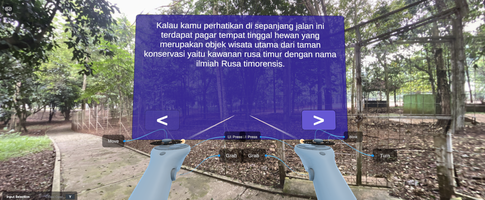
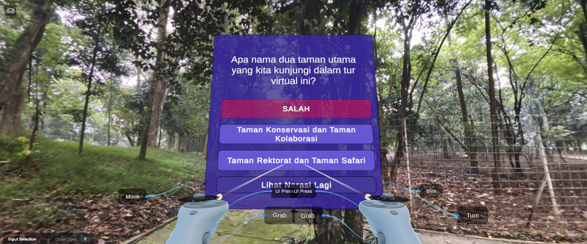
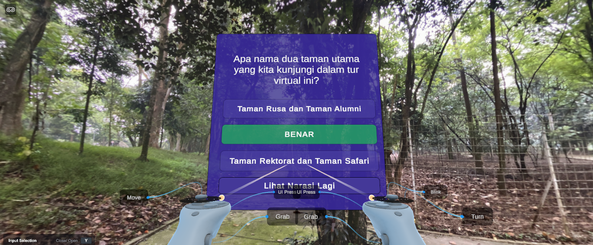

# Virtual Tour Taman Kolaborasi dan Taman Inovasi

## Anggota Kelompok

- Hamzah Hudzaifah - G6401231011
- Berton Adiwidya Wibowo - G6401231043
- Muhammad Ihsan Fadhillah - G6401231053

## Cara Menjalankan Proyek

Pastikan prasyarat ini tercapai sebelum masuk ke tahap selanjutnya:

- **Unity Hub**
- **Unity Editor `6000.1 LTS`**

> ⚠️ Note: pastikan versi Unity Editor sama `**6000.1 LTS**`, jika tidak, proyek ini tidak akan bisa dijalankan.

#### 1. Clone repository ini.

Buka terminal dan masukkan perintah:

```bash
git clone https://github.com/badiwidya/unity-virtual-tour.git
```

#### 2. Buka Unity Hub.

#### 3. Tekan tombol `Add`.

#### 4. Pilih folder dari [repo](#1-clone-repository-ini) ini yang ada komputer Anda.

#### 5. Pastikan versi Unity Editor sesuai, instal jika diperlukan, lalu buka proyek.

#### 6. Setelah proyek dimuat di Unity Editor, tekan tombol `▶` untuk menjalankan.

Nikmati pengalaman _virtual tour_ di **Taman Kolaborasi** dan **Taman Inovasi** ini!

## Screenshots Proyek












